# Conversational Artifacts

### Collecting thoughts that wanted to become software.

Small browser worlds, systems experiments, and field notes by [Tom Harwood / ncypher](https://github.com/ncypher). An idea starts in conversation, takes an executable form, and meets evidence that can change it.

**[Enter the collection](https://ncypher.github.io/tomfoolery/) · [Journal Room](https://ncypher.github.io/tomfoolery/journal/) · [Philosophy](https://ncypher.github.io/tomfoolery/artifacts/philosophy.html)**

[](https://ncypher.github.io/tomfoolery/polycentric-orchestra.html)

## Choose a question

| Artifact | What you can explore |
| --- | --- |
| [Polycentric Orchestra](https://ncypher.github.io/tomfoolery/polycentric-orchestra.html) | Govern a proposal with dissent, revision-specific evidence, and human acceptance |
| [Pixel Pet](https://ncypher.github.io/tomfoolery/pixel-pet.html) | Care for a pixel creature, grow a bond, and explore gentle feedback in a persistent terrarium |
| [Feedback Knot](https://ncypher.github.io/tomfoolery/feedback-knot.html) | Follow development through disagreement, appeals, and reopened questions |
| [AI Orchestra](https://ncypher.github.io/tomfoolery/ai-orchestra.html) | Compare specialized roles and review loops in the earlier orchestration sketch |
| [Crown & Cinder](https://ncypher.github.io/tomfoolery/crown-and-cinder.html) | Plan three orders per season, move armies, forecast battles, and resume a persistent campaign |
| [The Noisy Channel](https://ncypher.github.io/tomfoolery/shannon-noisy-channel.html) | Manipulate entropy, coding, noise, and error recovery |
| [What the Wren Hears](https://ncypher.github.io/tomfoolery/what-the-wren-hears.html) | See radio symbols as cyclic chirps |
| [Mandelbrot Lab](https://ncypher.github.io/tomfoolery/mandelbrot-lab.html) | Explore recursive structure through mathematical visualization |
| [Rubik's Cube — GPT-5.6 Sol](https://ncypher.github.io/tomfoolery/rubiks-cube-gpt-5-6-sol.html) | Inspect legal turns, scrambling, and an inverse-history solver |

The earlier [Space Invaders](https://ncypher.github.io/tomfoolery/space-invaders-pro.html), [Snake](https://ncypher.github.io/tomfoolery/snake-pro.html), [Cyber Runner](https://ncypher.github.io/tomfoolery/cyber-runner.html), and [Three.js cube](https://ncypher.github.io/tomfoolery/rubiks-cube-pro.html) remain part of the record. Pixel Pet has grown from the earlier virtual-pet sketch into a recoverable, persistent little world.

## The notebook behind the software

I began with browser games because they made the results of a conversation immediately visible. The questions grew: how should tools disagree, what deserves trust, and how does an observation become a rule?

Different models and tools contribute different strengths and failures. The human sets the purpose and remains responsible for acceptance. Tests, users, and runtime behavior can challenge the explanations everyone agreed on.

I am learning cybernetics through these working patterns. The collection is a developing practice: curious, provisional, and willing to revise its own language.

- [Philosophy](https://ncypher.github.io/tomfoolery/artifacts/philosophy.html): conversation as a development medium.
- [Workflow](https://ncypher.github.io/tomfoolery/artifacts/workflow.html): how a thought circulates through implementation and evidence.
- [Timeline](https://ncypher.github.io/tomfoolery/artifacts/timeline.html): a record of changing questions.
- [Repo Excavations](https://ncypher.github.io/tomfoolery/journal/2026/08-21-repo-excavations.html): failures that became rules, decoy realities, and software fossils.
- [What the Wren Hears — field report](https://ncypher.github.io/tomfoolery/journal/2026/08-21-what-the-wren-hears.html): what a visible signal helped me understand.

## Run and maintain

Serve this folder with any static HTTP server. The published HTML, CSS, JavaScript, and SVG are committed; visitors need no build step. Some older experiments load external libraries.

To edit a notebook room or field note, change its Markdown source, then run:

```sh
npm ci
npm run build
npm run check
npm test
```

The room builder generates the three `artifacts/*.html` pages, `journal/index.html`, and the two field-note pages. Add new field notes to the page list in `scripts/build-pages.mjs`. Commit the sources and generated pages together. `.nojekyll` keeps GitHub Pages from independently interpreting the same Markdown and creating competing routes.

The profile artwork is maintained in the related [ncypher repository](https://github.com/ncypher/ncypher). Its scored SVG is an illustrative animation. The interactive orchestra uses a small state machine with user-selected check outcomes; it does not claim to execute agents or real verification.

See [MAINTENANCE.md](MAINTENANCE.md) for the shared-asset workflow and publishing order.

---

**Do not make yourself write. Make yourself wonder.**
